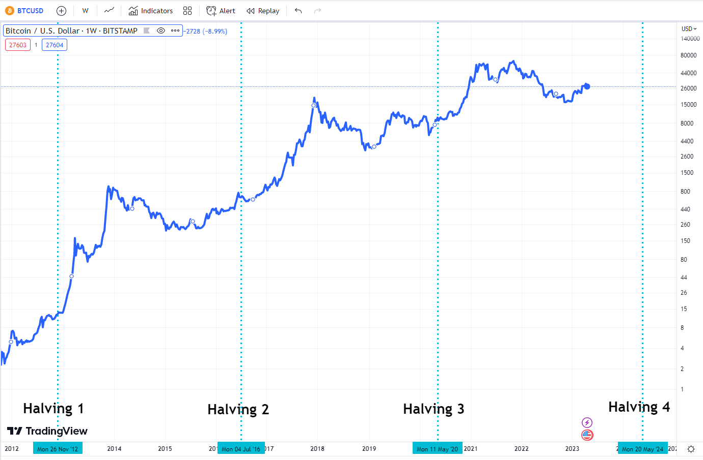
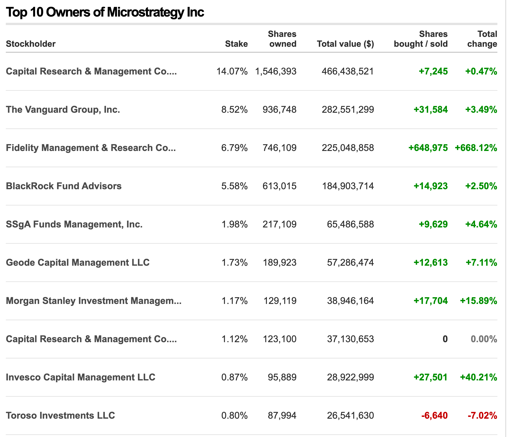

这篇文章，我们就来推断一下 Crypto 十年后的格局：那些币还会在？价格多少？币圈的玩
家构成？币圈的合规状态？

## 引言

2009年初，比特币公网上线至今（2023年）已经过去 14 年，这期间比特币经历了 3 次减
半[^half]，分别是 2012、2016、2020。每一次减半都伴随着整个币圈的牛市，每一次牛市
都伴随着比特币美金价格的数量级变化（10倍），从最初的 100，变成四位数，然后五位
数。基本上可以肯定，在 2024 年减半后，比特币会再次增加数量级，达到 10 万美金级
别。

单从价格来看这三次减半周期并不全面，每一次其实都有都非常不同的市场结构。接下来，
我们分析一下这三次周期的一些特征。x

## 减半周期

每一个减半周期是从一次减半到下一次减半所经过的是时间，这个时间是通过“区块时间”定
义的，每产生21000 个区块，比特币的区块奖励就会压缩一半。比如 2009 年比特币上线的
时候，每个区块会奖励 50个比特币，也就是每个区块会铸造额外 50 个比特币。在网络产
生 21000 个区块后，协议会自动把奖励降低到一半，即 25 个，以此类推。

所以我们会看到，每个周期大概是 4 年（第一个周期只有三年），因为每个块的平均出块
是是 10 分钟， 21000 大约是 4 年，但是这个时间对人类时间来说并不是精确的，而对于
区块时间是精确的 210000 个。

为什么区块奖励减半周期和比特币，乃至整个 Crypto 市场的价格运动周期如此一致呢？众
说纷纭，一般的说法是供应减少，即从供需的角度来解释这个现象。另外一个有趣的问题
是：比特币的减半周期带动了币圈的周期吗？

下面我们具体分析一下每一个周期的状态。

### 减半周期 (2019 - 2012)

无人问津、小众的“神奇互联网钱”[^internet]。

### 减半周期 (2012 - 2016)

在2012年至2016年期间，加密货币市场，尤其是比特币，经历了显著的增长并发生了几个重
要的发展。以下是这一时期的一些关键亮点：

- 比特币的早期采用：比特币作为第一个去中心化加密货币，在这段时间内获得了更广泛的
  认可并开始增加采用。从最初只吸引技术爱好者、自由主义者和早期采用者，逐渐引起了
  更多人的关注。
- 价格波动性：比特币价格表现出较高的波动性，因为它仍然是一种相对年轻和投机性的资
  产。在这一时期，比特币价格经历了显著的涨跌，反映了其不断演变的市场动态。
- 监管环境：各国政府和监管机构开始注意到加密货币。一些国家支持比特币，而其他国家
  采取谨慎的态度。监管框架开始形成，为未来的发展奠定了基础。
- Mt. Gox和安全问题：2014年，当时最大的比特币交易所Mt. Gox遭遇了一起重大的黑客攻
  击事件，导致大量比特币丢失。这一事件凸显了安全性的重要性，并导致在加密货币领域
  加强了对安全基础设施的关注。
- 替代币的出现：比特币的成功激发了替代性加密货币的创建，通常称为“替代币”。许多替
  代币，如莱特币和瑞波币，在这一时期出现，为加密货币市场引入了不同的特点和用途。
- 机构兴趣：在这一时期的末尾，传统金融机构和大公司开始对加密货币和区块链技术表现
  出兴趣。这种兴趣为随后几年机构参与加密货币市场奠定了基础。

总体而言，2012年至2016年期间见证了比特币从一种鲜为人知的数字资产发展为主流现象的
早期阶段。这一时期的发展为随后加密货币市场的增长和演变奠定了基础。

### 减半周期 (2016 - 2020)

进入大众视野，ICO 泡沫开启，充斥着谎言、欺诈。

### 减半周期 (2020 - 2024)

这是离我们最近的一个周期：

- 一切开始于 Covid，风险资产闪崩
- 2020，Covid 期间，各大央行开启了超大规模的印钱计划，刺激经济
- 2020，币圈自 ICO 泡沫后，开启了 Defi 泡沫，都是拜 ETH 的两个智能合约所赐
- 2022，Covid 过后，各大央行开启了有史以来最激进的加息进程，抑制通胀
- 2022，Defi 泡沫爆裂，一众诈骗公司破产
- 2023，SEC 对币圈进行激进地合规，BinanceUS，Coinbase 纷纷被起诉
- 2023，大型金融机构玩家开始大规模比特币建仓

这个最周期最特别的地方就是金融机构和合规机构的出现。之前的三个周期中，加密货币市
场极其缺乏合规，也没有任何有名望的金融机构大规模的介入，交易所千奇百怪，还有各种
皮包公司，假借软件公司的名义，做着金融机构的事情：交易所、借贷、融资等等。也正是
这些公司才催生了所谓的币圈，把真正的信号隐藏在了噪声之中。

不过，很多金融机构已经意识了真正的信号，并且开始行动。

首先，我们需要说 **MicroStrategy**[^micro]（简称 MS 把） 这家公司。这家公司的主
要业务是出售商业分析软件平台，与比特币本毫无关系。直到 2020 年，集团创始人
Michael J. Saylor 突然购置了当时价值 2.5 亿美元的比特币作为公司的储备资产。当时
Saylor 给出的理由是：因为公司的业务模式导致公司拥有非常充沛的现金流，但是美金并
不保值，需要一种可以保值的产品。在之后的几年时间内，MicroStrategy 持续比特币建
仓，截止 2023 年 6 月，该公司共持有 14 万枚比特币，是上市公司中持有比特币最多的
机构[^treasure]。

MS 并不是金融机构，只是一家重视比特币投资的上市科技公司，而且它的市值只有 40 亿
美金，并不算大公司，也谈不上知名公司。然后，当我们看 2023 年持有该公司的公司时，
事情就变得有趣了。

从上图我们可以看到，截止 2023 年 3 月，全球四大基金公司
BlackRock、Vanguard、Fidelity、Invesco持有超过了 20% MS 全部的股票，这份名单上我
们还看到了之名投资银行 Morgan Stanley。这些机构纷纷在 2023 年上半年大量增持了 MS
股票。他们增持的原因是看好 MS 呢？还是说看好比特币？这些机构的行为就是最好的信
号，聪明钱的信号。

第二，另外一个值得关注的事情便是 SEC 对加密货币的合规以及真正的机构交易所的出现。
最近比较典型的应该就是 EDX[^edx] 了，这是一家专门服务于金融机构的加密货币交易所，目前主要的
投资人为包括：Citadel Securities, Fidelity Digital Assets 等知名金融机构。

显然 EDX 出现在 SEC 起诉 Binance 等早起交易所的时间节点不是偶然的，这应该是给早起交易所的
致命一击。

## 下一个十年

如果我们假设周期持续下去，那么下一个十年，即 2033 年，会首先经历 2024 年的减半，
然后再经历两个减半周期，届时区块奖励会变成 0.78125。

随着合规完善，大型金融机构会进一步进入比特币市场，伴随而来的就是大量的现金流。BlackRock的
资管规模为 100 亿美金，而 Fidelity 也超过 50 亿美金。伴随现货 ETF 发行，也为可以购置
黄金的养老金打开进入比特币的大门。

合规的大型机构交易所，如 EDX [^dex]，会取代早解决的 crypto 交易所，为机构用户提供各种金融服务。
这也进一步为机构大规模进入比特币市场做好准备。

再来看看10年后还有哪些币会剩下呢？比特币是毫无疑问的，如果比特币没了，币圈可能就真的不存在了。
我们主要的问题其实是其他 Alt coin 会这么样呢？个人认为十年后的币种肯定会大大减少，不会像
现在这样百花正名了。

至于 ETH，我有些不确定他存在的意义是什么？因为本质上讲，一个 PoS 协议的 Crypto 与目前的
Security 没有任何区别，而所谓的去中心化，对于 PoS 协议本身就无法成立。

我做个大胆的预言：

- 币圈最终只会剩下比特币。而比特币也不是作为货币存在，而是一种数字稀缺，
更像一种商品，但是是互联网原生的商品，且稀缺。金融市场会围绕比特币构建各种衍生品：期货（已经有了）、
期权、ETF、Bond 等等。
- 比特币市值会达到 10 万亿美金，即比现在价值增长约 20 倍，或者说达到跟黄金一样的体量。

[^half]: <https://coincodex.com/article/22929/bitcoin-halving-dates/>
[^micro]: <https://en.wikipedia.org/wiki/MicroStrategy>
[^treasure]: <https://bitcointreasuries.net/>
[^internet]: <https://wangzhe3224.github.io/bitcoin-pro/21_ways/ch03/>
[^edx]: <https://edxmarkets.com/>
